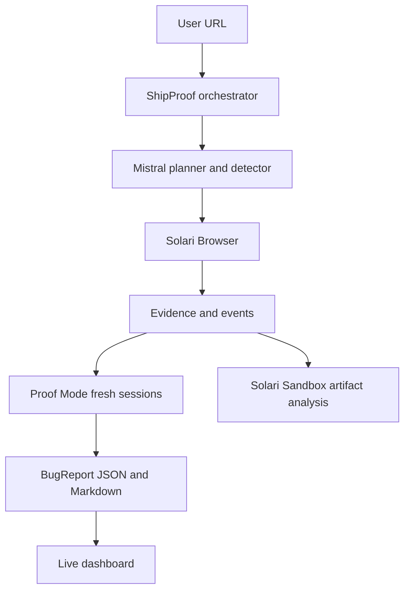

# ShipProof

ShipProof is an evidence-first autonomous QA engineer built as a Solari Cookbook extension. It uses Mistral to plan and reason, Solari Browser to execute authorized web tests, Solari Sandbox to process artifacts, and Proof Mode to reproduce suspicious behavior in fresh sessions before creating a BugReport.

## Architecture



ShipProof does not trust an AI-generated bug hypothesis. A detection is only a hypothesis; the report status comes from independent reproductions in fresh browser sessions.

## Setup

```powershell
cd shipproof
npm install
Copy-Item .env.example .env
```

Configure local environment variables without committing `.env`:

```text
SOLARI_API_KEY=
MISTRAL_API_KEY=
MISTRAL_MODEL=mistral-large-latest
SHIPPROOF_RUN_DIR=./runs
DASHBOARD_PORT=4174
```

## Run the product

Start the dashboard:

```powershell
npm run dashboard
```

Open `http://127.0.0.1:4174`, enter an authorized public URL, and select **Start QA run**. The UI receives real run events over SSE and renders generated BugReports and Solari screenshots.

For a direct CLI run:

```powershell
$env:SHIPPROOF_TARGET_URL="https://authorized-target.example"
npm run integration
```

The integration command requires `SOLARI_API_KEY`, `MISTRAL_API_KEY`, and `SHIPPROOF_TARGET_URL`. Runs write `events.json`, `metadata.json`, screenshots, sandbox analysis, and Markdown reports under `runs/<run-id>/`.

## Remote demo target

A remote Solari browser cannot reliably reach private localhost. Create a real public preview through Solari Sandbox instead:

```powershell
npm run demo:preview
```

The command prints a `*.preview.getsolari.com` URL and keeps the sandbox alive until interrupted. Paste that URL into the dashboard, then stop the preview with `Ctrl+C` after the run. The preview uses the Cookbook's `SolariClient`, `sandboxes.create`, `connect`, `files.write`, `commands.run`, `previewUrl`, and `kill` APIs.

The regular `npm run demo` command still serves the full local fixture at `http://127.0.0.1:4173` for manual inspection.

## Safety

Only test applications you own or are authorized to test. Actions are restricted to a typed allowlist; raw model output cannot execute shell commands or JavaScript. Destructive workflows, credential attacks, purchases, and irreversible data changes are outside the supported QA boundary. Screenshot artifacts are served only by run ID and basename, never by arbitrary filesystem path.

## Development

```powershell
npm run typecheck
npm test
```

The unit suite mocks Mistral responses and tests parsing, action safety, Proof Mode confidence, and report serialization. Live Solari and Mistral usage is intentionally separate because it requires credentials and remote resources.

## Project structure

- `src/llm/`: Mistral provider and versioned prompts.
- `src/orchestration/`: canonical pipeline and run state.
- `src/agent/`: validated browser actions and bounded loop.
- `src/verification/`: fresh-session Proof Mode.
- `src/reports/`: BugReport serialization.
- `src/sandbox/`: artifact analysis and demo preview.
- `web/`: live dashboard UI.
- `demo-app/`: deterministic intentionally buggy fixture.
